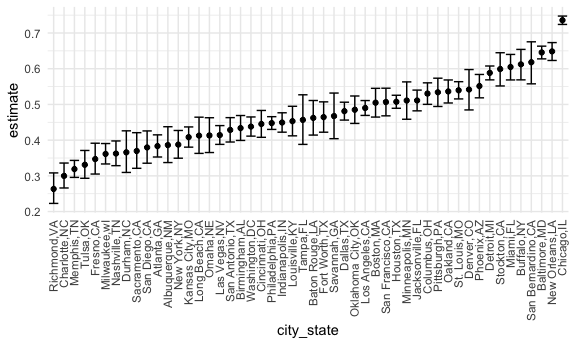
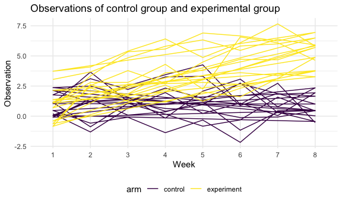

Homework 5
================
Jialiang Hua
11/16/2021

## Problem 1

read in the data

``` r
homicide_df = 
  read_csv("./data/homicide-data.csv", na = c("", "Unknown")) %>%
  mutate(
    city_state = str_c(city, state, sep = ","),
    resolution = case_when(
      disposition == "Closed without arrest" ~ "unsolved",
      disposition == "Open/No arrest" ~ "unsolved",
      disposition == "Closed by arrest" ~ "solved"
    )
  ) %>% 
  relocate(city_state) %>%
  filter(city_state != "Tulsa,AL")
```

The raw data consists of a case id, reported date of the case, the last
name and the first name of the victim, the race, age and gender of the
victim, the city and latitude, longitude the homicide was committed and
the disposition.

Let’s focus on Baltimore!

``` r
homicount_df =
  homicide_df %>% 
  group_by(city_state) %>% 
  summarize(
    hom_total = n(),
    hom_unsolved = sum(resolution == "unsolved")
  )
```

Let’s do a prop.test for Baltimore

``` r
prop.test(
  homicount_df %>% filter(city_state == "Baltimore,MD") %>% pull(hom_unsolved),
  homicount_df %>% filter(city_state == "Baltimore,MD") %>% pull(hom_total)) %>%
  broom::tidy()
```

    ## # A tibble: 1 × 8
    ##   estimate statistic  p.value parameter conf.low conf.high method    alternative
    ##      <dbl>     <dbl>    <dbl>     <int>    <dbl>     <dbl> <chr>     <chr>      
    ## 1    0.646      239. 6.46e-54         1    0.628     0.663 1-sample… two.sided

iterate across the cities…

``` r
result_df = 
  homicount_df %>% 
   mutate(
     prop_tests = map2(.x = hom_unsolved, .y = hom_total, ~prop.test(x = .x, n =.y)),
     tidy_tests = map(.x = prop_tests, ~broom::tidy(.x))
   ) %>% 
  select(-prop_tests) %>% 
  unnest(tidy_tests) %>% 
  select(city_state, estimate, conf.low, conf.high)
```

make a plot!

``` r
result_df %>% 
  mutate(city_state = fct_reorder(city_state, estimate)) %>% 
  ggplot(aes(x = city_state, y = estimate)) +
  geom_point() +
  geom_errorbar(aes(ymin = conf.low, ymax = conf.high)) +
  theme(axis.text.x = element_text(angle = 90, vjust = 0.5, hjust = 1))
```



## Problem 2

Import the dataset

``` r
path_df =
  tibble(
    path = list.files("./data/data2")
  ) %>% 
  mutate(
    path = str_c("./data/data2/", path),
    observations = map(.x = path, ~read_csv(.x))
  ) %>% 
  separate(path, c("subject_id", "format"), sep = ".csv" ) %>% 
  separate(subject_id, c("format","subject_id"), sep = "2/" ) %>% 
  select(-format) %>% 
  separate(subject_id, c("arm","subject_id"), sep = "_") %>% 
  mutate(
    arm = case_when(
      arm == "con" ~ "control",
      arm == "exp" ~ "experiment")
  ) %>% 
  unnest(observations) %>% 
  pivot_longer(
    week_1:week_8,
    names_to = "week",
    values_to = "observations"
  ) %>% 
  mutate(
    week = str_replace(week,"week_",""),
    week = as.factor(week)) 
```

Make a spaghetti plot

``` r
spaghetti_plot = 
  path_df %>%
  ggplot(aes(x = week, y = observations, group = arm, color = arm)) + 
  geom_path() +
  labs(
    title = "Observations of control group and experimental group",
    x = "Week",
    y = "Observation"
  )
ggsave("spaghetti_plot.jpg")
```

    ## Saving 6 x 3.6 in image

``` r
spaghetti_plot
```



Comment: In these eight weeks, we can finds that in experimental groups,
the overall observational values are higher than the control groups. And
the trend of the experimental groups is increasing. As for the control
groups, the trend is approximately fluctuating without apparent trend.

## Problem 3

introduces some missing values in each column.

``` r
library(tidyverse)

set.seed(10)

iris_with_missing = iris %>% 
  map_df(~replace(.x, sample(1:150, 20), NA)) %>%
  mutate(Species = as.character(Species))
```

write a function…

``` r
fill_in = function(vector) {
  
  if (is.numeric(vector)) {
    vector = replace(vector, is.na(vector), mean(vector, na.rm = TRUE))
  }
  
  else if (is.character(vector)) {
    vector = replace(vector, is.na(vector), "virginica")
  }
  
  else {
    stop("Data should be either number or character")
  }
  
  return(vector)
  
}
```

Apply the function

``` r
iris_with_missing %>% 
  map_df(~ fill_in(.))
```

    ## # A tibble: 150 × 5
    ##    Sepal.Length Sepal.Width Petal.Length Petal.Width Species
    ##           <dbl>       <dbl>        <dbl>       <dbl> <chr>  
    ##  1         5.1          3.5         1.4         0.2  setosa 
    ##  2         4.9          3           1.4         0.2  setosa 
    ##  3         4.7          3.2         1.3         0.2  setosa 
    ##  4         4.6          3.1         1.5         1.19 setosa 
    ##  5         5            3.6         1.4         0.2  setosa 
    ##  6         5.4          3.9         1.7         0.4  setosa 
    ##  7         5.82         3.4         1.4         0.3  setosa 
    ##  8         5            3.4         1.5         0.2  setosa 
    ##  9         4.4          2.9         1.4         0.2  setosa 
    ## 10         4.9          3.1         3.77        0.1  setosa 
    ## # … with 140 more rows
