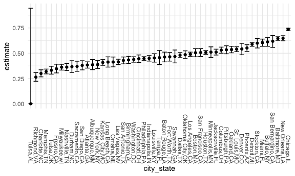
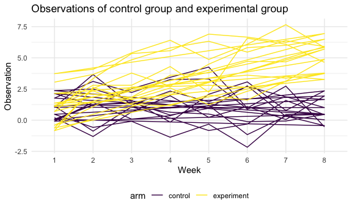

Homework 5
================
Jialiang Hua
11/16/2021

``` r
library(tidyverse)
library(purrr)

knitr::opts_chunk$set(
  fig.width = 6,
  fig.asp = .6,
  out.width = "90%"
)

theme_set(theme_minimal() + theme(legend.position = "bottom"))

options(
  ggplot2.continuous.colour = "viridis",
  ggplot2.continuous.fill = "viridis"
)

scale_colour_discrete = scale_colour_viridis_d
scale_fill_discrete = scale_fill_viridis_d
```

## Problem 1

read in the data

The raw data consists of a case id, reported date of the case, the last
name and the first name of the victim, the race, age and gender of the
victim, the city and lagitude, longitude the homicide was committed and
the disposition.

``` r
homicide_df = 
  read_csv("./data/homicide-data.csv") %>%
  janitor::clean_names() %>% 
  mutate(
    city_state = str_c(city, state, sep = ","),
    resolved = case_when(
      disposition == "Closed without arrest" ~ "unsolved",
      disposition == "Open/No arrest" ~ "unsolved",
      disposition == "Closed by arrest" ~ "solved"
    )
  )
```

    ## Rows: 52179 Columns: 12

    ## ── Column specification ────────────────────────────────────────────────────────
    ## Delimiter: ","
    ## chr (9): uid, victim_last, victim_first, victim_race, victim_age, victim_sex...
    ## dbl (3): reported_date, lat, lon

    ## 
    ## ℹ Use `spec()` to retrieve the full column specification for this data.
    ## ℹ Specify the column types or set `show_col_types = FALSE` to quiet this message.

``` r
homicount_df =
  homicide_df %>% 
  group_by(city_state) %>% 
  summarize(
    hom_total = n(),
    hom_unsolved = sum(resolved == "unsolved")
  )
```

Let’s do a prop.test for Baltimore

``` r
prop.test(
  homicount_df %>% filter(city_state == "Baltimore,MD") %>% pull(hom_unsolved),
  homicount_df %>% filter(city_state == "Baltimore,MD") %>% pull(hom_total)) %>%
  broom::tidy()
```

    ## # A tibble: 1 × 8
    ##   estimate statistic  p.value parameter conf.low conf.high method    alternative
    ##      <dbl>     <dbl>    <dbl>     <int>    <dbl>     <dbl> <chr>     <chr>      
    ## 1    0.646      239. 6.46e-54         1    0.628     0.663 1-sample… two.sided

iterate through the cities…

``` r
result_df = 
  homicount_df %>% 
   mutate(
     prop_tests = map2(.x = hom_unsolved, .y = hom_total, ~prop.test(x = .x, n =.y)),
     tidy_tests = map(.x = prop_tests, ~broom::tidy(.x))
   ) %>% 
  select(-prop_tests) %>% 
  unnest(tidy_tests) %>% 
  select(city_state, estimate, conf.low, conf.high)
```

    ## Warning in prop.test(x = .x, n = .y): Chi-squared approximation may be incorrect

make a plot!

``` r
result_df %>% 
  mutate(city_state = fct_reorder(city_state, estimate)) %>% 
  ggplot(aes(x = city_state, y = estimate)) +
  geom_point() +
  geom_errorbar(aes(ymin = conf.low, ymax = conf.high)) +
  theme(axis.text.x = element_text(angle = -90, vjust = 0.5, hjust = 1))
```



## Problem 2

Import the dataset

``` r
path_df =
  tibble(
    path = list.files("./data/data2")
  ) %>% 
  mutate(
    path = str_c("./data/data2/", path),
    observations = map(.x = path, ~read_csv(.x))
  ) %>% 
  separate(path, c("subject_id", "format"), sep = ".csv" ) %>% 
  separate(subject_id, c("format","subject_id"), sep = "2/" ) %>% 
  select(-format) %>% 
  separate(subject_id, c("arm","subject_id"), sep = "_") %>% 
  mutate(
    arm = case_when(
      arm == "con" ~ "control",
      arm == "exp" ~ "experiment")
  ) %>% 
  unnest(observations) %>% 
  pivot_longer(
    week_1:week_8,
    names_to = "week",
    values_to = "observations"
  ) %>% 
  mutate(
    week = str_replace(week,"week_",""),
    week = as.factor(week)) 
```

Make a spaghetti plot

``` r
spaghetti_plot = 
  path_df %>%
  ggplot(aes(x = week, y = observations, group = arm, color = arm)) + 
  geom_path() +
  labs(
    title = "Observations of control group and experimental group",
    x = "Week",
    y = "Observation"
  )
ggsave("spaghetti_plot.jpg")
```

    ## Saving 6 x 3.6 in image

``` r
spaghetti_plot
```


